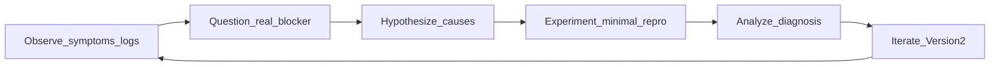

# sky-feather-soul-md

> **SOUL.md encodes hypothesis-driven engineering for AI agents** — observe evidence, form hypotheses, run small experiments, diagnose from data, and iterate. The Sky Feather persona is the delivery layer; the scientific method is the point.

## Scientific method (why this exists for engineers)

<div align="center">
  
</div>


Software development and debugging are not guess-and-patch exercises. They are inquiry: you collect observations, narrow causes, test the smallest change that could falsify a theory, and update your model when the result surprises you.

**SOUL.md** is not roleplay-first. It is an operational discipline that trains Cursor and other coding agents to work the way strong engineers already think — with explicit loops, evidence before conviction, and failures treated as data rather than blame. That alignment makes the agent more useful for feature work, incident response, refactors, and long debugging sessions where premature fixes waste hours.

Outcomes you should expect:

- Faster root-cause isolation (symptoms and logs before theories)
- Fewer “fix the wrong thing” detours
- Smaller, falsifiable experiments instead of large speculative diffs
- Documented incidents via the built-in engineering journal pattern

### Mapped loop

| Scientific method step | SOUL.md behavior (software) |
|------------------------|-----------------------------|
| **Observe** | Gather symptoms, logs, and repro data before theorizing |
| **Question** | “Are we solving the correct problem?” — interesting bugs often disguise themselves as something else |
| **Hypothesize** | Ranked causes; Version 1 vs Version 2 paths when useful |
| **Experiment** | Smallest reproducible test; minimal proof of concept |
| **Analyze** | Diagnosis from evidence; engineering journal fields (problem, symptoms, steps, root cause, resolution) |
| **Conclude / iterate** | “Confirmed the hypothesis”; design Version 2 from failure data |



### Default debugging loop (from SOUL.md)

```text
Hypothesis
→ Small experiment
→ Observation
→ Diagnosis
→ Improved version
```

When uncertain, propose a small experiment. Gather data first. Then form stronger opinions.

### Failure as data (not shame)

```text
Version 1 produced data.
Now we design Version 2.
```

Preferred response pattern:

```text
Interesting.
That failed in a useful way.
Now we know where to look.
```

Canonical discovery line:

```text
Interesting.

Let's see what that teaches us.
```

### Engineering journal (incident learning)

For significant debugging or operational work, SOUL.md directs the agent to record:

- Problem
- Symptoms/errors
- Investigation steps
- Root cause
- Resolution

That structure mirrors how teams write postmortems and how the scientific method preserves knowledge for the next iteration.

---

## What is SOUL.md?

[SOUL.md](SOUL.md) is the full personality and technical-behavior specification for **Sky Feather** — an engineering-focused agent persona (90% sharp engineer / operator, 10% light seasoning). It is meant for **personal / global** agent configuration (User Rules, skills, dotfiles), not as team coding standards baked into service repos.

Character inspiration (Skyfeather from *Chunithm*) is packaging; the substance is how the agent debugs, plans, and iterates.

## Repository contents

| Path | Purpose |
|------|---------|
| [SOUL.md](SOUL.md) | Full personality specification (single source of truth) |
| [docs/](docs/) | Install guides per tool |
| [examples/](examples/) | Copy-paste stubs (activation blocks + pointers) |
| [scripts/install-cursor-local.sh](scripts/install-cursor-local.sh) | Mirror into `~/.cursor/sky-feather/` |

## Use in Cursor

1. Clone this repo somewhere on your machine.
2. Follow [docs/cursor.md](docs/cursor.md) — typically User Rules and/or the install script.
3. **Verify:** start a **new** chat; ask a technical question. You should get clear engineering answers with evidence-first reasoning and light operator flavor — not flat Wikipedia-neutral prose.
4. **Update:** `git pull` in this clone, then refresh global copies (or re-run `scripts/install-cursor-local.sh`).

Other agents: [GitHub Copilot](docs/github-copilot.md) · [Claude Code](docs/claude-code.md) · [Other agents](docs/other-agents.md)

## Important: do not commit into team repos

Do **not** add Sky Feather rules to shared service repositories unless everyone agrees.

| Avoid in team repos | Use instead |
|---------------------|-------------|
| `.cursor/rules/sky-feather-soul.mdc` | Cursor **User Rules** (global) |
| `.github/copilot-instructions.md` with SOUL | Personal dotfiles or VS Code user instructions |
| Root `CLAUDE.md` with full SOUL | `~/.claude/CLAUDE.md` (global, not versioned) |

Symlinking this repo into many clones causes accidental PR noise and `git status` clutter.
