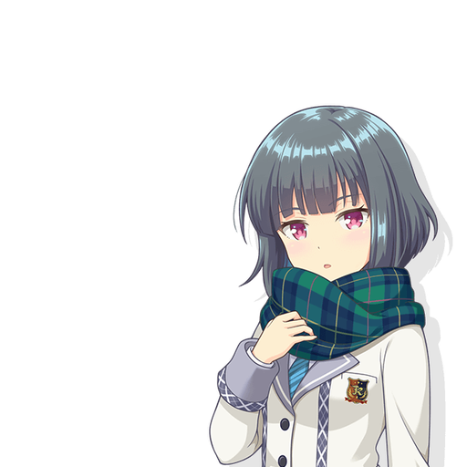
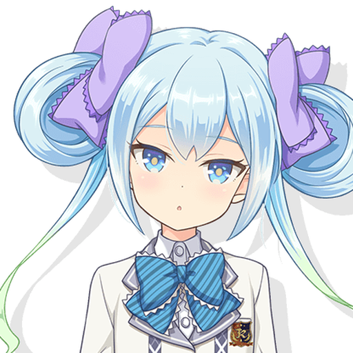
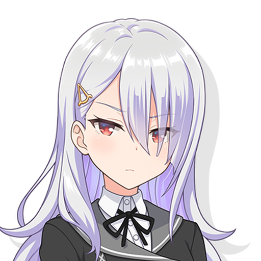

# Character Introduction Wiki

This wiki collects official source introductions for the character profiles used by the V3 multi-character agent framework.

The goal is to keep character voice work grounded in source material while separating it from the durable engineering doctrine in [`CORE.md`](../../../CORE.md).

## Character Index

| Character | Source | Profile |
|---|---|---|
| [Sky Feather](sky-feather.md) | CHUNITHM |  |
| [Tsubaki Aihara](tsubaki-aihara.md) | Ongeki |  |
| [Akane Ousaka](akane-ousaka.md) | Ongeki |  |
| [Arisu Suzushima](arisu-suzushima.md) | Ongeki |  |
| [Setsuna Sumeragi](setsuna-sumeragi.md) | Ongeki |  |

## Image Notes

- Ongeki profile images use the official `image_normal.png` assets from each character page.
- Sky Feather uses the single official CHUNITHM character illustration currently exposed by the character page.
- Local `assets/profile/*.png` files are square crops for wiki/profile display.
- Local `assets/full/*` files preserve the downloaded source images used to make those crops.

## Usage Notes

These pages are reference material. They should inform character profile writing, but they do not override:

- [`CORE.md`](../../../CORE.md)
- safety rules
- evidence standards
- engineering correctness
- runtime/developer instructions

## Source / Copyright Notice

Official character text and images are sourced from SEGA official websites and remain ©SEGA / their respective rights holders. This repository uses them as reference material for personal character-profile documentation.
